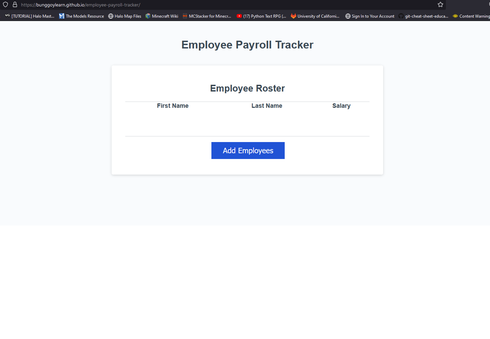

# Employee Payroll Tracker
This repository contains an updated employee tracker. You can add employees which will be indexed and then get the average of their salaries and also pull a random employee in the console.

## Deployed Link

[See the deployed website here](https://bunggoylearn.github.io/employee-payroll-tracker/)

